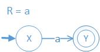
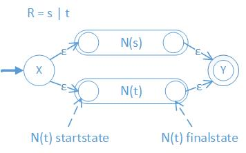
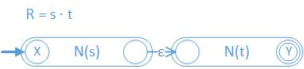
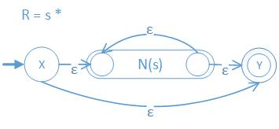
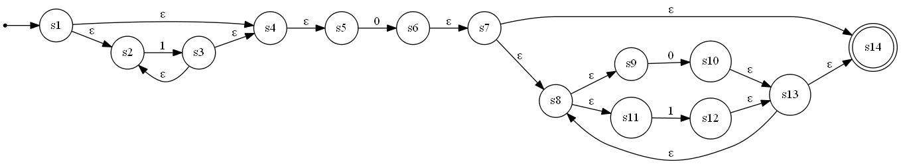
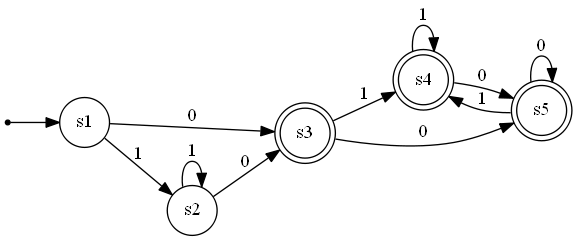
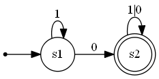

## Finite-Automata-Machine

### Regex -> NFA

- `Regex2NFA.basicstruct` 

- `Regex2NFA.linestruct` 

- `Regex2NFA.dotstruct` 

- `Regex2NFA.starstruct` 

### Sample Generation

- Sample regex: `1*0(0|1)*`
- Sample-generated NFA:  

- Sample-generated DFA:  

- Sample-generated minDFA:  
